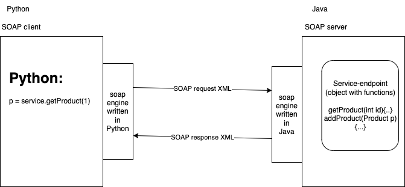

# RESTful service using Flask

## What is ReST?

-   Representational State Transfer
-   Transfer (exchange between client and server) of State (data/resource) in different Representations (XML, JSON, Text, CSV, HTML etc)
-   Initially drafted by **Roy Fielding**, who is the co-creator of HTTP protocol
-   Based on 6 constraints
    -   Uniform interface (we use URLs to represent a resource)
        -   http://example.com/api/products
        -   http://example.com/api/products/12
    -   Client/ Server
    -   Stateless (each request to the server must be a new one)
    -   Cacheable
    -   Layered
    -   Code on demand (Optional)
-   HTTP verbs determine the "ACTION" to be performed on the "Resource"
    -   GET - retrieves one or more "items" from the "Resource"
        -   GET http://example.com/api/products --> get all products
        -   GET http://example.com/api/products/23 --> get a single product with id 23
    -   PUT and PATCH
        -   Modify the content of a single item in the resource
        -   PUT http://example.com/api/products/23 (carrying the new data as payload) should update the details of product with id 23
    -   DELETE - deletes the resource with the given id (generally not implemented. Instead soft delete is performed.)
    -   POST - creates one or more "items" and adds to the existing "Resource"
-   Content negotiation
    -   HTTP headers (Accept and Content-Type) can be used by the client to negotiate with the server for different represnetations of the resource.
    -   Accept: application/json --> should ask a JSON version of the resource
    -   Accept: application/xml --> should ask a XML variant of the same.
    -   Content-Type: application/json --> should inform the server that client is sending (during POST/PUT/PATCH) JSON payload.



### SOAP request

```
POST /soap-service/ProductService HTTP/1.1
Host: example.com

<?xml version="1.0">
<envelope>
    <header />
    <body>
        <getProduct>
            <id>12</id>
        </getProduct>
    </body>
</envelope>

```

### SOAP response

```
HTTP/1.1 200 ok
Host: example.com

<?xml version="1.0">
<envelope>
    <header />
    <body>
        <getProductResponse>
            <product>
                <id>12</id>
                <name>...</name>
                ...
                ..
            </product>
        </getProductResponse>
    </body>
</envelope>

```

Trainer: Vinod

Email: vinod@knowledgeworksindia.com or vinod@vinod.co
